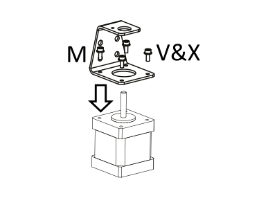
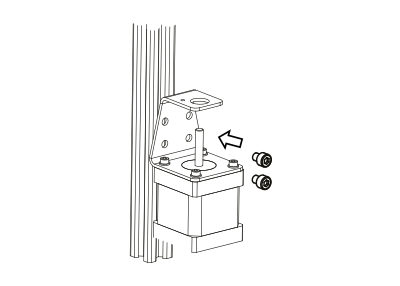
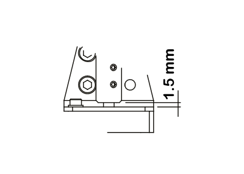

Installation of the Nimble V3 (The Flex)
=============================

The Flex in detail
--------------------

General overview of the parts of the Flex. 

Before we begin
---------------

Because of the process used to make the plastic parts (SLS) there is a possibility of powder remaining inside some of the smaller openings. For instance, there might still be a little powder left in the holes for the mounting bolts. 
This is the moment to inspect the parts and to make sure they are all powder free. 

Example of mounting a Flex
----------------------

Overall steps to mount the Flex.

* Assemble the Flex.
* Fix the mount onto the printer.
* Attach the hot-end.
* Insert PTFE and slice to length.
* Mount Flex on top.
* Mount stepper bracket and connect drive cable.
* Insert drive cable in Nimble and done!

Positions of the Flex
----------------------

Some possible positions of the Flex

* All the positions shown can be achieved simply be re-positioning the same parts.
* These are some of the positions, more are possible.
* You can choose a left handed or right handed orientation of the base body.
* Then you can select the angle of the worm housing that will best fit your printer.
* Then you can select on which side the drive cable will enter the worm housing. 
.. Note:: When positioning the worm housing for a horizontal drive cable, you must place the drive cable entering from the back, not the front. 

Assemble the Flex
===================

Step 1
------
Assemble gear and hob

* Slide the hob(K) into the gear(G).
* Slide the bearings (V) on both ends of the gear and hob.

Step 2
------
Insert the hob into the Hobbit

* You will use the assmbled gear shaft and the Hobbit (part A)
* Insert the gear shaft, Hob first, into the Hobbit.
* There is a little edge inside the Hobbit, so you will need to wriggle it past.
* Make sure the bearing on the end of the Hob is inserted fully.

Step 3
------
Insert worm into the two bearings

* You will use the Worm (part H) and both the Worm Bearings (part W)
* Place a bearing on each of the worm ends.

Step 4
------
Insert worm into the Worm Housing 

* You will use the assembled worm and the Worm Housing (part B)
* Slide the worm with bearings into the Worm Housing.
* This can take a little force, just push it through.

Step 5
------
Closing the Worm Housing

* You will use the Sleeve Clamp (D) and the Plug (part J)
* Screw the Sleeve Clamp into the Worm Housing.
* Screw the Plug into the other side of the Worm Housing.
    
.. Note:: This is the moment where you decide which way the drive cable will enter the Worm. So make sure you understand the direction you need.  

Step 6
------
Assemble Breech

* Place the Breech Bearing (U2) into the space of the Breech (I).
* Insert Breech Pin (U1) through breech body and bearing from the same side shown in diagram.

Step 7
------
Add Lubrication

* Put a few drops of the lubrication on the teeth of the gear.
* No need to overdo it, just a drop or two.

Step 8
------
Assemble the Flex

.. figure:: images/N38.Flex_Assembly.svg
    :alt:  Flex Assembly
    :height: 300px
    :width: 300px

* Hold the Hobbit in one hand.
* Slide the Worm Housing over the gear end of the gear shaft.

.. Note:: Make sure the bearing on the gear is fully seated in the Worm Housing.

Step 9
------
Place the Side Clamp

* You will need the Side Clamp (C) and the assembled Flex.
* Slide the Side Clamp onto the Worm Housing.
* Make sure the base of the side clamp is parallel to the base of the Hobbit.

Attach the mount on the printer
===============================

Each printer is different so the actual parts will vary, but overall the steps are the same. 
Shown is a generic block for a mount. 

Attach the Mount
----------------

Every hot-end needs a PTFE tube down the inside. With the Flex there is no need to clamp the PTFE tube, the Flex locks it into place. So any bowden connector or PTFE clamp is not needed. 

* Slide the PTFE tube into the hot-end making sure it goes as deep as it can go. 
* Slide the Clip (F) over the PTFE tube in the correct orientation and slide it down onto the Mount. (As shown above)
* Slice the PTFE tube flush with the Clip.

We use the Clip in this way to make sure you get the right length of PTFE tube.
You are now ready to install the Flex.

Installing the Flex
=====================
* Place a piece of filament in the hot-end.
* Place the Flex in the correct orientation over the Mount and the Clip. 
* Push down and the Clip will click into a groove in the Flex. 
* Take the Breech and click it closed, clamping the filament. (This centers the Flex over the hot-end)
* Use the screws to attach the Flex to the Mount.

Do not overtighten. Finger tight and an extra quarter turn are more than enough.
You have now installed the Flex and can install the stepper side.

Installing Stepper side
=======================

Overall the steps are to install the Bracket, install the Coupler, slide the drive cable in and tighten everything down.

Mounting the Drive cable
========================

Step 1
------

    Mount stepper to Bracket

    * Mounting the Bracket (part M) to your stepper, using the M3 screws (O). The center hole will make sure the stepper is centered in the Bracket. If the center hole is too big, please try to center the Bracket as perfectly as you can.

Step 2
-------

    Bolt Bracket to printer

    * Mount the stepper to your printer frame. The image shows it being mounted to a 20x20 aluminium profile. Other methods can be; mounting it to the base, attaching it to a bracket and mounting that to your printer or any other way of fixing the stepper to your printer.
    
    .. Note:: The mounting hardware is not included with the Flex.

Step 3
-------

    Insert Coupler on stepper shaft

    * Place the Coupler (part L) on the shaft of the stepper. The Coupler should fit through the top hole of the Bracket. Slide it down until there is approx 1.5 mm space between the stepper base and the Coupler. See step 12

Step 4
-------

    Tighten bottom set screw

    * Rotate the Coupler until the bottom set screws are perpendicular to the flat on the stepper shaft (if there is one). Make sure there still is approx 1.5 mm space between the stepper base and the Coupler and tighten the bottom set screw (part N).

Step 5
-------

    Slide Drive Cable Sleeve into Sleeve Clamp (Stepper side)

    * Take the Sleeve Clamp (part C) and slide the Drive Cable Sleeve (part S) in the top, as far as it will go. There is a little step in the bottom of the sleeve clamp to make sure the sleeve goes in just to the right depth. 
    * Clamp the sleeve using the M3 screw (part P) and a nut (part Q). Tighten the screw nice and tight. There is a little ridge inside the sleeve clamp to prevent you from squeezing the sleeve too far and jamming the drive cable.

Step 6
-------

    Insert Sleeve clamp into stepper bracket, taking note of the 3 tabs

    * Mount the Sleeve Clamp (E) to the Bracket.
    * There is a flat tab with a bump underneath, that should line up with the hole after locking the sleeve clamp in place. It should click into the small hole in the bracket.

Step 7
-------

    This could need force, we designed it to be tight. 

    * If it takes too much force, use a adjustable wrench or something for the first time. 
    * It needs to be tight as the surface of the clamp smooths out over time. 

Step 8
-------

    Slide Drive Cable into Coupler. 

    * Now, take the drive cable itself (part T), both ends have square sides pressed into it. Even here it is reversible. Slide one end into the Drive Cable Sleeve and thread it all the way through. It will slide into the Coupler. Slide it all the way down and clamp it using the remaining 4 set screws (part N)

Step 9
-------

    Slide Drive Cable Sleeve into Sleeve Clamp (Flex side) 

    * Back to the Flex side. 
    * Slide the Sleeve, now containing the drive cable as well, into the next Sleeve Clamp (part D) and push it down as far as it will go. Use the M3 screw (part P) and the half nut (part Q) to clamp the sleeve. 

    .. Note:: After mounting the Flex in place, you can loosen this screw a little to adjust the direction of the drive cable. Allow it to have a relaxed and free arch to the stepper.

Step 10
-------

    Insert square end of Drive Cable into worm gear inside the Flex

Step 11
-------

    * Insert the drive cable into the worm and then slide it down. To place the sleeve clamp correctly, make sure you line up the tabs with the 3 slots on the Flex. This can take a little push the first time. As long as you make sure it is aligned properly, this is not a problem.

The Flex is now ready for calibration.

Using the Flex
################

First run the extruder a minute or two, with no filament clamped. Just to bed the gears and drive cable in. Extrude and retract a few times. (You will have to switch off the temperature control as most controllers will not move the extruder stepper unless the hot end it up to temperature)
Use M302 P1 on RepRapFirmware to switch cold extrusion on (allow extrusion while cold) and M302 P0 to switch it off again.
For other firmware use M302 S0 to switch cold extrusion on and M302 S170 to set extrusion to a minimum temp of 170C.

Insert filament
###############

To insert filament, open the breech block. You do this by squeezing together the "ears" of the breech block and pulling outwards. You can leave the shafts of the breech block in or, for better visibility, take the whole breech block out. 

Now you can see the top of the hot end (usually, depends on the adapter used) and slide the filament in. If the hot end is up to the correct temperature, you can purge the old filament by simply pushing down on the filament and feeding it into the hot end. After the old filament is cleared you can close the breech block.

.. Note:: this is is an excellent way to get a sense of the efficiency of your hot end. You can feel the resistance of the hot end and how easy it is to push the filament through.

To close the breech block, place the shafts into the slots of the "forks" on the Flex, rotate until vertical and the ears click into place. The Flex is now ready to use.

If the hot end is up to temperature, you can now test the extrusion. Simply extrude about 10 mm and observe how the filament comes out of the hot end. It should be a neat straight line.

Tuning the firmware
####################

Before using the Flex you need to tune the firmware and calibrate the extrusion. You will need to tune the firmware first, as the Flex is quite a different type of extruder. 

See the :doc:`Tuning the Firmware<.tuning>` page.

