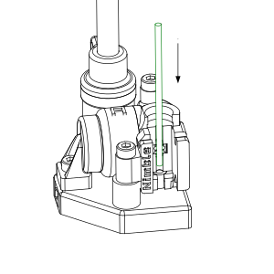

Using the Flex
================

The Flex is designed to be easy to use. Here are the basic tips to make it even better.

Loading the filament
--------------------

The filament loading mechanism is based on the breech loading idea of old muskets. Instead of fiddly work trying to insert the filament from the top, guide it past the hob and into a hot end you cannot see, we decided to open it up and show to the whole path.

.. Note:: It is a lot faster to do that to read about it.

**Open it up**

    Open the breech

    * Squeeze the "ears" together.
    * Pull the ears forward, away from the Flex.
    * This can require a little force the first few times. 
    * Now drop the Breech down out of the "forks" on the Flex.

**Have a look**

    Overview of the filament path

    * Have a look between the forks
    * You can see the hob and the hot end opening
    * If you are using PTFE lining, you can see if the lining is tight against the Nimble.

**Insert filament**

    Placing the filament

    * It is now easy to slide the filament into the hot end.
    * Slide it all the way down, into the melt chamber.

**Close the breech**

    Closing the breech is a snap

    * Step 1, place the prongs into the slots on the bottom forks from below
    * Step 2, rotate the breech upwards
    * Squeeze the ears in and slide between the upper forks
    * The breech will click into place

Great, done. The filament is loaded and ready to print. That took about a minute or so to read, but it will take about 2 seconds to do. 

Tips and tricks
---------------

When the breech block is open en there is no filament, you have a good opportunity to have a look at the hob, to see if it is clean. Also, have a look at the PTFE lining, if you use it in your situation, to see if it is still tight against the Nimble base.

When inserting the filament and IF the hot end is up to working temperature, you can use the new filament to purge the rest of the previous filament. 
Simply press the filament down into the hot end, without the breech in place. You can feel the filament melt and be pushed through the melt zone and out the nozzle. Continue pushing gently until all the previous filament is gone.

.. Note:: This is a GREAT way to sense if there is a blockage or another problem in your nozzle or melt zone.

You could even use this to fix two printed parts together. Simply hold the 2 parts together, place them against the hot nozzle and while you feed in some filament, "weld" the 2 parts together. We have done it and admittedly, it is tricky to hold the two parts together properly with one hand, but if the parts are suitable, it works like a charm.   
