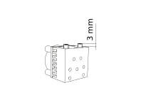
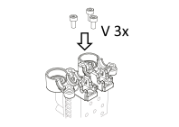
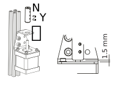
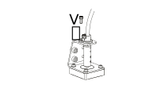
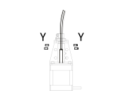
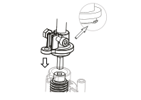

Assembling a Nimble C/C
==========================

Step 1
------

    Insert nuts into C/C base

    * Take the Nimble C/C base (Part D) and place it upside down on the table. 
    * Take 4 M3 nuts (part S) and place each into the pockets provided in the C/C base. The places are clear to recognise as they are the only hexagonal shaped holes on the base.
    * The nuts need to be pushed all the way down and will lock into place. To make this easier, you can use a M3 screw like part T to screw into the nut and use that to push the nut down to the bottom of the hexagonal hole. 

Step 2
------   

    Insert bearings for worms

    * Turn the C/C base right side up and insert the two Worm Bearings (part P) into the housing.
    * This can require a little force. If you cannot get it right, you can use the Worm (part G) to push the bearings in properly.

Step 3
------  

    Insert PTFE tubing into Chimera/Cyclops

    * Take the heat sink of the Chimera/Cyclops and insert some PTFE liner into the filament holes. 
    * Make sure the liner protrudes the top of the heat sink by exactly 3 mm. This is only if the C/C base is bolted directly on top of the Chimera/Cyclops hot end.
    * If an adapter is used, make sure the PTFE tube sticks up through the adapter by 3 mm. The C/C base has space in the bottom to lock the PTFE tube into place.

Step 4
------  

    Mount C/C base on Chimera/Cyclops or adapter

    * Mount the C/C base on the Chimera/Cyclops. Use 3 M3 screws (part V) for this. 
    * If the C/C is mounted using an adapter, check the adapter page to see if additional steps need to be taken. 

Step 5
------  
       

    Insert worms

    * Insert the 3 Worm gears (part G) into the bearings in the C/C base.

Step 6
------

    Insert hob and place bearings

    * To assemble the gear shaft take the following parts:

      * Gear shaft bearings (Part Q) 2x
      * Gear shaft/Hobbed wheel (Part J)
      * Gear wheel (H)

    * Notice that on the end of the plastic part of the gear shaft we have included a little indicator to show you that the gear is turning. The shafts are so smooth that you would not be able to see it otherwise. If you want you can use a permanent marker to colour the top surface of the indicator to make it more visible.

    * Insert the Gear shaft into the Gear and make sure the flat parts match. This needs a little push as it is supposed to be a close fit. 
    * Now fit the Gear shaft bearings on both sides and hold it together while going to the next step.

Step 7
------

    Mount gear shafts

    * Fit the combined gear shaft and hob into the C/C base making sure the teeth of the gear mesh nicely with the worm gear. 

Step 8
------

    Insert bearings for worms

    * You will use the Worm bearings (part P) and both the shell housings (parts A and B)
    * Insert one bearing into each of the shell housing. This can require a little force. If you cannot get it right, you can use the Worm (part G) to push the bearings in properly. 
    * Do this for both the bottom and the top shell. 

Step 9
------

    Close the Nimble C/C

    * Close the Nimble C/C by placing the upper shells. 
    * Make sure the worm gear is seated nicely in the bearing and that the seam is completely closed. If not, it means that the bearings for the Worm are not properly seated. Press down until it is fully closed. 
    * Do this for both sides.

Step 10
-------

    Insert 2 closing bolts

    * For now use only 2 bolts (part T) to bolt the Nimble C/C together using the outer bolt holes. This is done to close the C/C and keep everything together while you complete the drive cable and sleeve.

    .. Note:: Do not tighten these M3 bolts too tight. Simply finger tight and a 1/4 turn is enough.

Step 11
-------

    Click in Breech blocks

    * Now you can place the Breech blocks (part E) into the housing. This will lock into place with a click. 
    * To do so, keep the breech block horizontal, place the shafts into the bottom grooves of the housing and rotate the breech block upwards, between the upper "forks" until it clicks into place.
    * Do this for both sides.

Step 12
-------

    Mount stepper to Bracket

    * Moving to the other end, the stepper. Mounting the Bracket (part M) to your stepper, using the M3 screws and washers (V and X). The center hole will make sure the stepper is centered in the Bracket. If the center hole is too big, please try to center the Bracket as perfectly as you can.

Step 13
-------

    Bolt Bracket to printer

    * Mount the stepper to your printer frame. The image shows it being mounted to a 20x20 aluminium profile. Other methods can be; mounting it to the base, attaching it to a bracket and mounting that to your printer or any other way of fixing the stepper to your printer.

    .. Note:: Fixing hardware not included for mounting bracket to printer

Step 14
-------

    Insert Coupler on stepper shaft

    * Place the Coupler (part N) on the shaft of the stepper. The Coupler should fit through the top hole of the Bracket. 
    * Slide it down until there is approx 1.5 mm space between the stepper base and the Coupler.
    * Rotate the Coupler until the bottom set screws are perpendicular to the flat on the stepper shaft. 
    * Make sure there still is approx 1.5 mm space between the stepper base and the Coupler and tighten the bottom set screw (part Y).
    * Do this for both steppers.

Step 15
-------

    Slide Drive Cable Sleeve into Sleeve Clamp (Stepper side)

    * Take the Sleeve Clamp (part C) and slide the Drive Cable Sleeve (part F) in the top, as far as it will go. There is a little step and the bottom of the sleeve clamp to make sure the sleeve goes in just the right depth.
    * Clamp the sleeve using the M3 screw (part Z) and the Half nut (part W). Tighten the screw nice and tight. There is a little ridge inside the sleeve clamp to prevent you from squeezing the sleeve too far and jamming the drive cable.
    * Do this for both steppers.

Step 16
-------

    Insert Sleeve clamp into stepper bracket

    * Mount the Sleeve Clamp to the Bracket.
    * Take care of the little lip. So insert the sleeve clamp using a little rocking motion. This lip prevents the sleeve clamp from lifting up during use. 
    * Do this for both steppers.

Step 17
-------

    Bolt Sleeve Clamp to Bracket 

    * Use the M3 screw (part V) to bolt the sleeve clamp to the bracket.
    * Do this for both steppers.

Step 18
-------

    Slide Drive Cable into Coupler 
    * Now, take the drive cable itself (part L), both sides have square sides pressed into it. Even this is reversible. 
    * Slide one end into the Drive Cable Sleeve and thread it all the way through. It will slide into the Coupler. 
    * Slide it all the way down and clamp it using the remaining 4 set screws (part Y)
    * Do this for both steppers.

Step 19
-------

    Slide Drive Cable Sleeve into Sleeve Clamp (Nimble side)

    * Back to the Nimble C/C side.
    * Slide the Sleeve, now containing the drive cable as well, into the next Sleeve Clamp (part C) and push it down as far as it will go. 
    * Use the M3 screw (part Z) and the half nut (part W) to clamp the sleeve. 

    .. Note:: After mounting the Nimble C/C in place, you can loosen this screw a little to adjust the direction of the drive cable, allowing it to have a relaxed and free arch to the stepper.

Step 20
-------

    Insert Drive Cable into worm gear inside Nimble C/C

    * Insert the drive cable into the worm and then slide it down. 
    * To place the sleeve clamp correctly, make sure you line up the bolt holes of the sleeve clamp and the Nimble and then with a rocking motion, slip the little lip into the space provided in the Nimble. 
    * Push down and the sleeve clamp should slip into position. 
    * This can take a little push the first time. As long as you make sure it is aligned properly, this is not a problem.
    * Do this for both sides of the Nimble C/C.

Step 21
-------

    Bolt Sleeve to Nimble C/C

    * Now use the remaining screws (part T) to bolt the Sleeve clamp to the Nimble C/C base. 

    .. Note:: Do not overtighten these M3 bolts. Simply finger tight and a 1/4 turn is enough.

    * The Nimble C/C is now installed. 
    * Have a good look to see if all looks the way you think it should and correct any things that do not look right.
    * This is also the moment to adjust the direction of the drive cable, so that it forms a nice arch to the stepper, as mentioned in step 17. So loosen the short M3 screw from the half nut until you can just rotate the drive cable sleeve. Once it is in position, make sure it is seated properly by pressing down and then tighten the screw again. 
    * Do this for both sides of the Nimble C/C

Alternate positions
-------------------

    Alternate positions of the Chimera/Cyclops block and the bolt positions used

    * The Nimble C/C can be mounted in 2 different positions relative to the Chimera/Cyclops hot end. The heat end can be mounted with the fan at the back or at the front, compared to the breeches. 
    * Alternate bolt holes are provided to facilitate this other position.  

Using the Nimble C/C
#####################

First run the extruders a minute or two, with no filament clamped. Just to bed the gears and drive cable in. Extrude and retract a few times. (You will have to switch off the temperature control as most controllers will not move the extruder stepper unless the hot end it up to temperature)
Use M302 P1 on RepRapFirmware to switch cold extrusion on (allow extrusion while cold) and M302 P0 to switch it off again.
For other firmware use M302 S0 to switch cold extrusion on and M302 S170 to set extrusion to a minimum temp of 170C.

Insert filament
###############

To insert filament, open the breech blocks. You do this by squeezing together the "ears" of the breech block and pulling outwards. You can leave the shafts of the breech block in or, for better visibility, take the whole breech block out. 

Now you can see the PTFE on the top of the Chimera/Cyclops (usually, depends on the adapter used) and slide the filament in. If the hot end is up to the correct temperature, you can purge the old filament by simply pushing down on the filament and feeding it into the hot end. After the old filament is cleared you can close the breech block.

.. Note:: this is is an excellent way to get a sense of the efficiency of your hot end. You can feel the resistance of the hot end and how easy it is to push the filament through.

To close the breech blocks, place the shafts into the slots of the "forks" on the Nimble, rotate until vertical and the ears click into place. The Nimble is now ready to use.

If the Chimera/Cyclops is up to temperature, you can now test the extrusion. Simply extrude about 10 mm and observe how the filament comes out of the hot end. It should be a neat straight line.

Tuning the Firmware
###################

Before using the Nimble you need to tune the firmware and calibrate the extrusion. You will need to tune the firmware first, as the Nimble is quite a different type of extruder. 

See the :doc:`Tuning the Firmware<./tuning>` page or click Next.

