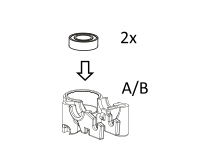
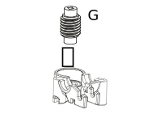
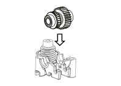
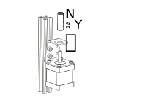
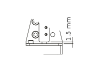
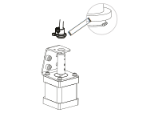
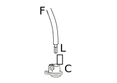
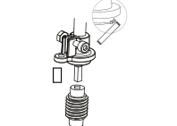

Assembling the Nimble
=======================

Step 1
------

    Insert bearings for worm

    * You will use the Worm bearings (part P) and both the shell housings (parts A and B)
    * Insert one bearing into each of the shell housing.
    * This can require a little force. If you cannot get it right, you can use the Worm (part G) to push the bearings in properly. 
    * Do this for both the bottom and the top shell.

Step 2
------

    Insert worm

    * You might have done this already to force the bearing in, but place the Worm (part G) in the bearing of the Bottom housing.

Step 3
------

    Insert hob and place bearings

    * To assemble the gear shaft take the following parts:

      * Gear shaft bearings (Part Q) 2x
      * Gear shaft/Hobbed wheel (Part J)
      * Gear wheel (H)

    * Notice that on the end of the plastic part of the gear shaft we have included a little indicator to show you that the gear is turning. The shafts are so smooth that you would not be able to see it otherwise. If you want you can use a permanent marker to colour the top surface of the indicator to make it more visible.

    * Insert the Gear shaft into the Gear and make sure the flat parts match. This needs a little push as it is supposed to be a close fit. 
    * Now fit the Gear shaft bearings on both sides and hold it together while going to the next step.

Step 4
------

    Mount gear shaft

    * Fit the combined gear shaft and hob into the Nimble making sure the teeth of the gear mesh nicely with the worm gear.

Step 5
------

    Close Nimble

    * Close the Nimble by placing the Top shell half. Make sure the worm gear is seated nicely in the bearing and that the seam is completely closed. If not, it probably is caused by the fact that the bearings for the Worm are not properly seated. Press down until it is fully closed.

Step 6
------

    Click Breech block

    * To keep the Nimble closed and together, you can place the Breech block (part E) into the housing. This will lock into place with a click. To do so, keep the breech block horizontal, place the shafts into the bottom grooves of the housing and rotate the breech block upwards, between the upper "forks" until it clicks into place.

Step 7
------

    When mounting on a plate, use the Groove mount adaptor

    * Mount the Nimble on your printer. If you are using an adapter, have a look at the adapter page to see if there are any specific instructions for that adapter.
    * The overall procedure if using the Groove Mount Adapter (Part D) is to have the Hot end in place, place the Groove mount adapter over the top of the hot end and place the Nimble on top of that, making sure the little tabs fit inside the "forks" of the Nimble. This locks the Nimble to the hot end and keeps it centered.

Step 8
------

    Using another mount, check instructions. 

    * For now use only 1 bolt (part T) to bolt the Nimble to the adapter or printer. This is done to lock it in and keep everything together while you prepare the drive cable and sleeve.

    .. Note:: Here you might need the M3 nuts.

Step 9
------

.. figure:: images/1_step09.svg
    :alt: Mount stepper to Bracket
    :height: 400px
    :width: 286px

    Mount stepper to Bracket

    * Moving to the other end, the stepper. Mounting the Bracket (part M) to your stepper, using the M3 screws and washers (V and X). The center hole will make sure the stepper is centered in the Bracket. If the center hole is too big, please try to center the Bracket as perfectly as you can.

Step 10
-------

    Bolt Bracket to printer

    * Mount the stepper to your printer frame. The image shows it being mounted to a 20x20 aluminium profile. Other methods can be; mounting it to the base, attaching it to a bracket and mounting that to your printer or any other way of fixing the stepper to your printer.
    
    .. Note:: The mounting hardware is not included with the Nimble.

Step 11
-------

    Insert Coupler on stepper shaft

    * Place the Coupler (part N) on the shaft of the stepper. The Coupler should fit through the top hole of the Bracket. Slide it down until there is approx 1.5 mm space between the stepper base and the Coupler. See step 12

Step 12
-------

    Tighten bottom set screw

    * Rotate the Coupler until the bottom set screws are perpendicular to the flat on the stepper shaft (if there is one). Make sure there still is approx 1.5 mm space between the stepper base and the Coupler and tighten the bottom set screw (part Y).

Step 13
-------

    Slide Drive Cable Sleeve into Sleeve Clamp (Stepper side)

    * Take the Sleeve Clamp (part C) and slide the Drive Cable Sleeve (part F) in the top, as far as it will go. There is a little step in the bottom of the sleeve clamp to make sure the sleeve goes in just to the right depth. 
    * Clamp the sleeve using the M3 screw (part Z) and the Half nut (part W). Tighten the screw nice and tight. There is a little ridge inside the sleeve clamp to prevent you from squeezing the sleeve too far and jamming the drive cable.

Step 14
-------

    Insert Sleeve clamp into stepper bracket, taking note of the lip

    * Mount the Sleeve Clamp to the Bracket.
    * Take care of the little lip. So insert the sleeve clamp using a little rocking motion. This lip prevents the sleeve clamp from lifting up during use.

Step 15
-------

.. figure:: images/1_step15.svg
    :alt: Bolt Sleeve Clamp to Bracket
    :height: 400px
    :width: 286px

    Bolt Sleeve Clamp to Bracket

    * Use the M3 screw (part V) to bolt the sleeve clamp to the bracket. 

Step 16
-------

.. figure:: images/1_step16.svg
    :alt: Slide Drive Cable into Coupler
    :height: 400px
    :width: 286px

    Slide Drive Cable into Coupler. 

    * Now, take the drive cable itself (part L), both ends have square sides pressed into it. Even here it is reversible. Slide one end into the Drive Cable Sleeve and thread it all the way through. It will slide into the Coupler. Slide it all the way down and clamp it using the remaining 5 set screws (part Y)

Step 17
-------

    Slide Drive Cable Sleeve into Sleeve Clamp (Nimble side) 

    * Back to the Nimble side. 
    * Slide the Sleeve, now containing the drive cable as well, into the next Sleeve Clamp (part C) and push it down as far as it will go. Use the M3 screw (part Z) and the half nut (part W) to clamp the sleeve. 

    .. Note:: After mounting the Nimble in place, you can loosen this screw a little to adjust the direction of the drive cable. Allow it to have a relaxed and free arch to the stepper.

Step 18
-------

    Insert square end of Drive Cable into worm gear inside Nimble

    * Insert the drive cable into the worm and then slide it down. To place the sleeve clamp correctly, make sure you line up the bolt hole of the sleeve clamp and on the Nimble and then with a rocking motion, insert the little lip into the space provided in the Nimble. Push down and the sleeve clamp should slip into position. This can take a little push the first time. As long as you make sure it is aligned properly, this is not a problem.

Step 19
-------

.. figure:: images/1_step19.svg
    :alt: Affix Nimble
    :height: 400px
    :width: 286px

    Use second bolt to affix Sleeve Clamp and Nimble in position

    * Now use the remaining screw (part T) and perhaps the remaining M3 nut, to bolt the Nimble to the printhead or effector. The Nimble is now installed. Have a good look to see if it all looks the way you think it should look and correct any things that do not look right. 
    * This is also the moment to adjust the direction of the drive cable, so that it forms a nice arch to the stepper, as mentioned in step 17. So loosen the short M3 screw from the half nut until you can just rotate the drive cable sleeve. Once it is in position, make sure it is seated properly by pressing down and then tighten the screw again.
     

Using the Nimble
################

First run the extruder a minute or two, with no filament clamped. Just to bed the gears and drive cable in. Extrude and retract a few times. (You will have to switch off the temperature control as most controllers will not move the extruder stepper unless the hot end it up to temperature)
Use M302 P1 on RepRapFirmware to switch cold extrusion on (allow extrusion while cold) and M302 P0 to switch it off again.
For other firmware use M302 S0 to switch cold extrusion on and M302 S170 to set extrusion to a minimum temp of 170C.

Insert filament
###############

To insert filament, open the breech block. You do this by squeezing together the "ears" of the breech block and pulling outwards. You can leave the shafts of the breech block in or, for better visibility, take the whole breech block out. 

Now you can see the top of the hot end (usually, depends on the adapter used) and slide the filament in. If the hot end is up to the correct temperature, you can purge the old filament by simply pushing down on the filament and feeding it into the hot end. After the old filament is cleared you can close the breech block.

.. Note:: this is is an excellent way to get a sense of the efficiency of your hot end. You can feel the resistance of the hot end and how easy it is to push the filament through.

To close the breech block, place the shafts into the slots of the "forks" on the Nimble, rotate until vertical and the ears click into place. The Nimble is now ready to use.

If the hot end is up to temperature, you can now test the extrusion. Simply extrude about 10 mm and observe how the filament comes out of the hot end. It should be a neat straight line.

Tuning the firmware
####################

Before using the Nimble you need to tune the firmware and calibrate the extrusion. You will need to tune the firmware first, as the Nimble is quite a different type of extruder. 

See the :doc:`Tuning the Firmware<./tuning>` page.

