Installing the Nimble
==================

If you aren't using our CR-10 Kit, you can skip to the section after Step 11 titled Stepper control.

Step 1
------

* Heat up the hot end, when hot remove the filament, then let it cool down again.
* Pull the white PTFE tube out of the bowden connector. (If difficult, you can do this after step 6)
* Unscrew bowden connector and remove it.
* Undo the tape holding the bowden tube to the braided sleeve. 
* Keep the tape for the last step.

Step 2
------

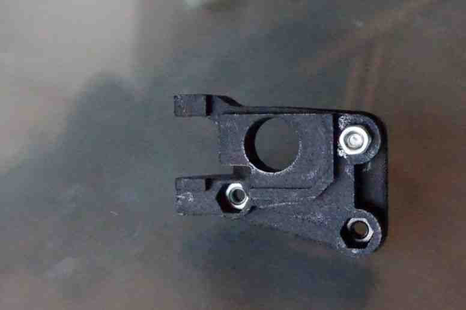
   
    Insert 3 x M3 nuts into the nut traps underneath the Nimble Sidewinder mounting block.
    
    .. Note:: Easiest way to do it, is to screw a nut onto the long M3 screw and use that to push the nut in the space.

Step 3
------

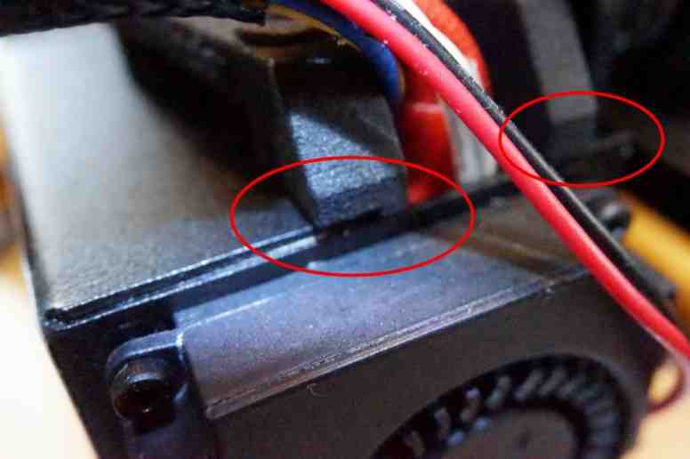

    Slide the mount block in sideways, making sure no wires are trapped on the right hand side.

    * Push the block to the left and down, till the right side clicks into the opening.

Step 4
------

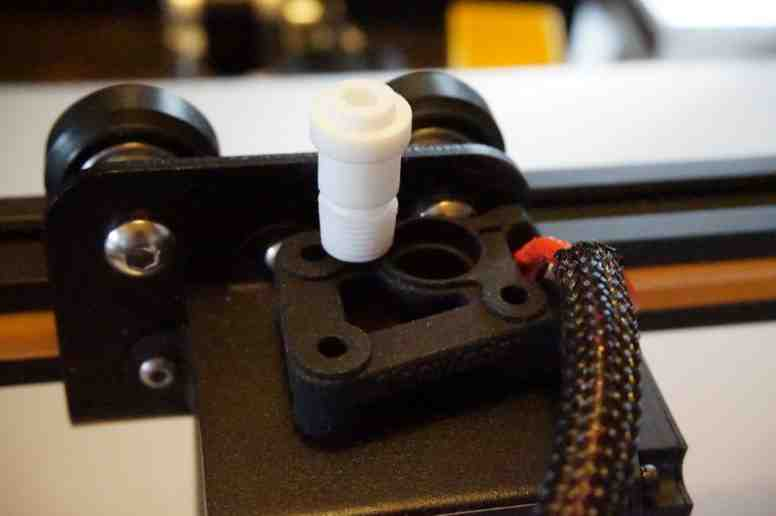

    Pull the block forward until the mount screw will slide down into the hot end.
 

Step 5
------
       
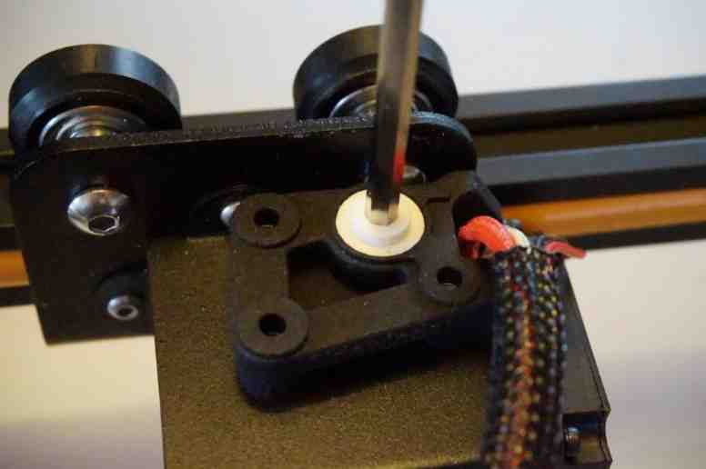

    Use a 4mm allen key to screw in the mount screw.

    * Make sure the Mount Screw has no powder left inside.  

Step 6
------

Slide the PTFE tube all the way down. 

* Roughly 50mm into the hot end. Total length of the PTFE tube is 48.8 mm

Step 7
------

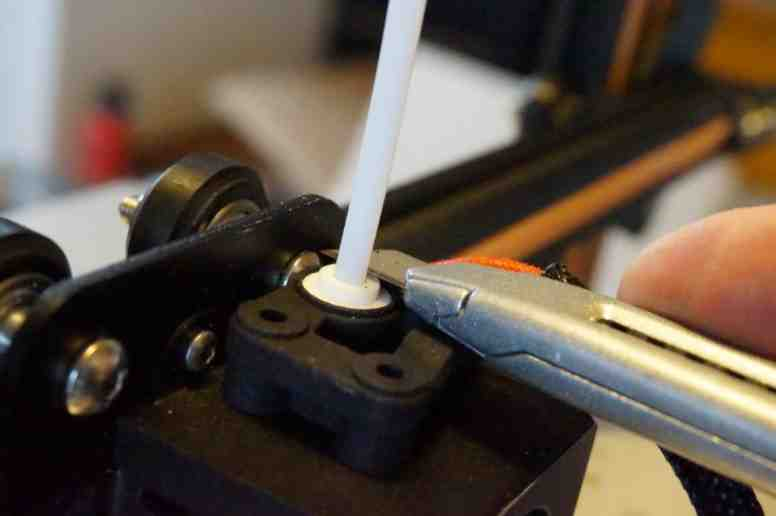

    Slice off the PTFE tube at the top Flush with the top of the mounting screw.

Step 8
------

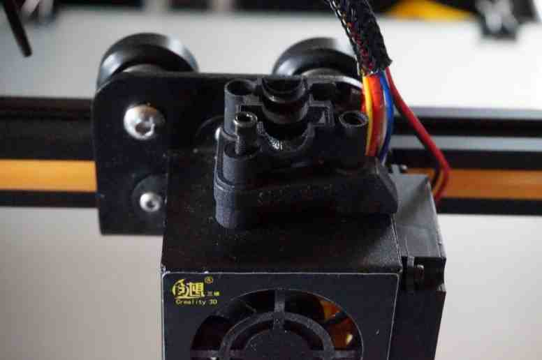

    Fit the Bottom half of the Nimble Sidewinder 

    * Insert and tighten the first M3 screw. Use the M3x16 screw in hole 1
    * Do not overtighten these M3 bolts. Simply finger tight and then and additional 1/4 turn is enough. 

Step 9
------

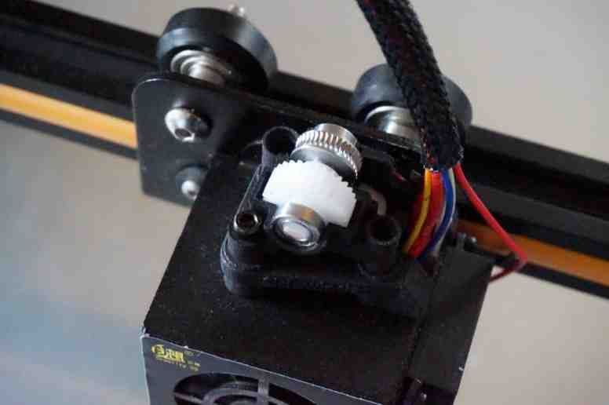

    Insert the gear shaft with bearings, then close with the top half of the Nimble Sidewinder 

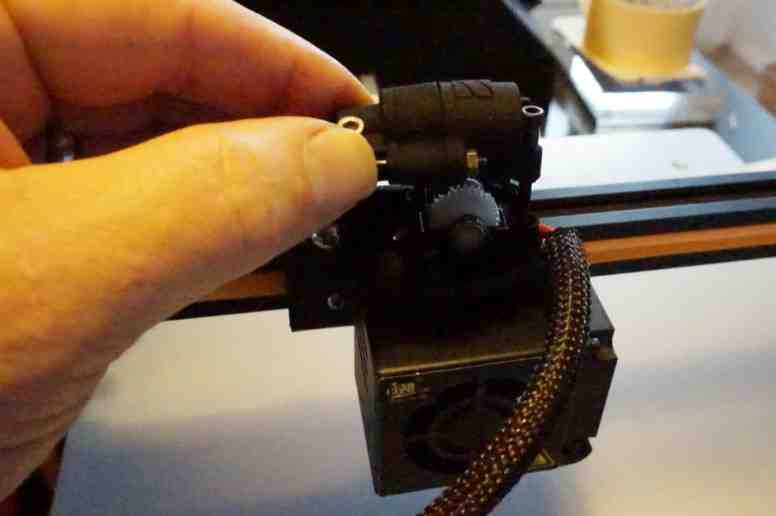

    Use the next screw, M3x25 to tighten down the top half, in hole 2.

    * Do not overtighten these M3 bolts. Simply finger tight and then an additional 1/4 turn is enough.

Step 10
------

    Insert the worm into the top half and close using the Worm lid.
    Use the M3x30 screw to bolt the top half to the mounting block, in hole 3.

Step 11
-------

    Insert the drive cable, via the connected sleeve clamp, in to the Worm and lock it in by rotating the Sleeve clamp.
    Place the M3 nut against the hole in the Top Housing and use the last screw, the M3x20, to lock the Sleeve clamp, Worm lid and Top housing together.
    
    .. Note:: You can use the cloth tape that you took off in the second step to keep the drive cable sleeve and the wires in the braided sleeve together, if you want.

Stepper control
===============

First of all a warning. in Step 16 you will need to work inside the control box while the power is on. So be careful, make sure you know which wires carry the mains and make sure you do not get close to those.
Do this carefully and slowly. Just to be clear, there is a small risk of damaging the board if you mess up. So it is you responsibility to do this right, we are not to blame if you don't. 

    .. Note:: Ideally use a non-conductive screwdriver to adjust the pot.

You need to reverse the direction of the stepper. If you have flashed the firmware, you can do that easily in the firmware.
If not, you need to switch two wires at the plug going into the extruder stepper. 

Step 12
-------

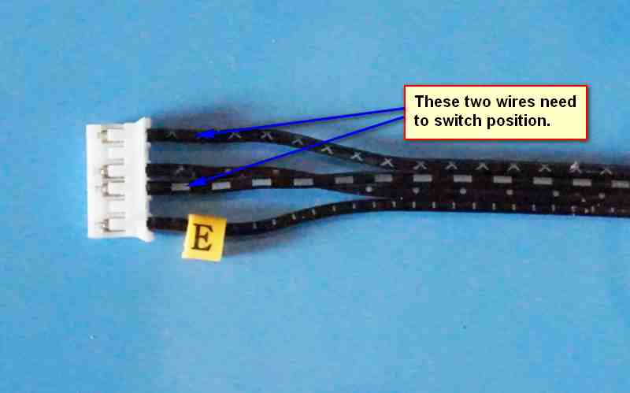

    This is how it looks before modification.

Step 13
-------

    At the plug you will see little plastic tabs. One by one, lift these two and gently pull the wire out.
    Switch these two wires.

    .. Note:: So, counting from the orange tab, the outside wire goes into the second spot and the second wire goes into the fourth spot.

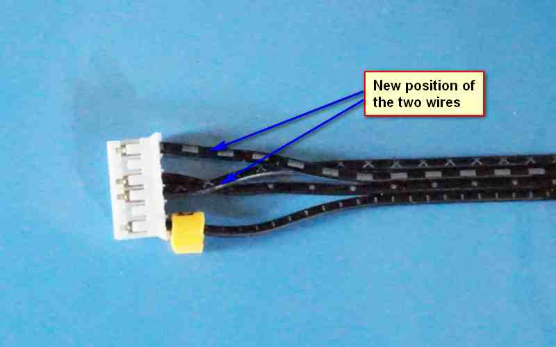

    This is what it looks like after you are done.

Step 14
-------
    Unplug the power supply for now.
    Place the control box upside down, after removing the spool holder if you use it.

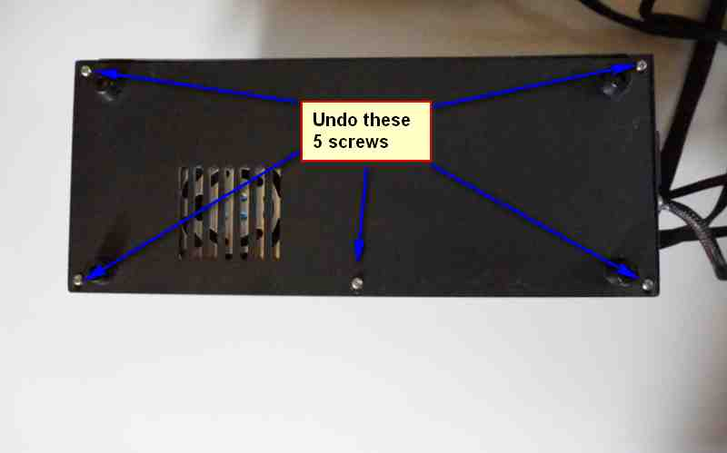

    Undo these 5 screws, take off the base plate and put it aside. 

Step 15
-------

    Now you see the power unit, this needs to be moved aside, but the wires can all stay connected.

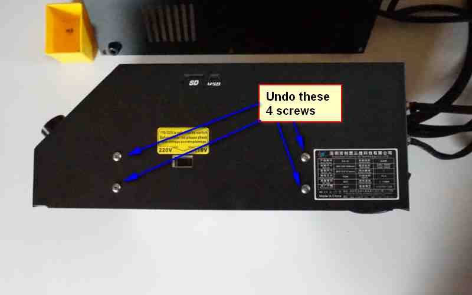

    Undo the four screws on the side.
    Lift out the power unit and put it on the side where the control cables come out. 

    .. Note:: Support it with something roughly the same height as the control box. 

    .. figure:: images/Box3_opt.jpg
    :alt: Inside of the control box
    :height: 500px
    :width: 800px

    Now you can see the control board. Isn't small!

Step 16
-------

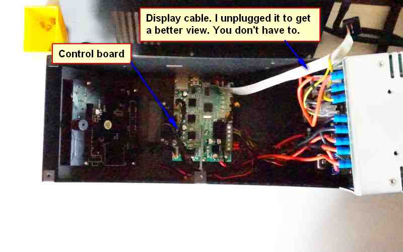

    The POT meter you need to adjust the Vref on is shown as is the Groun point you can use. 

    * Adjust it to roughly 0.25 V. You do this by measuring the voltage between the center of the POT meter and the Ground using a multimeter.

    .. Note:: You will have to plug in the power and switch on the machine to test this, so be careful! Ideally use a non-conductive screwdriver to adjust the pot.

Step 17
-------
    
Done! 
Put the power unit back, using the four screws and then close the control box with the base plate.

Using the Sidewinder
====================

Step 1
-------

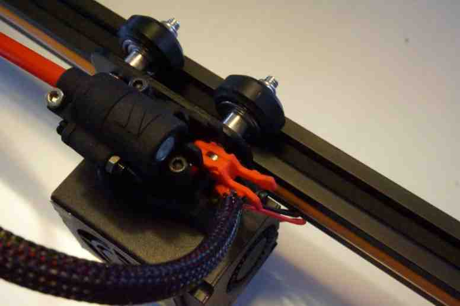

    Open the Breech block by squeezing the "ears" together.

Step 2
-------

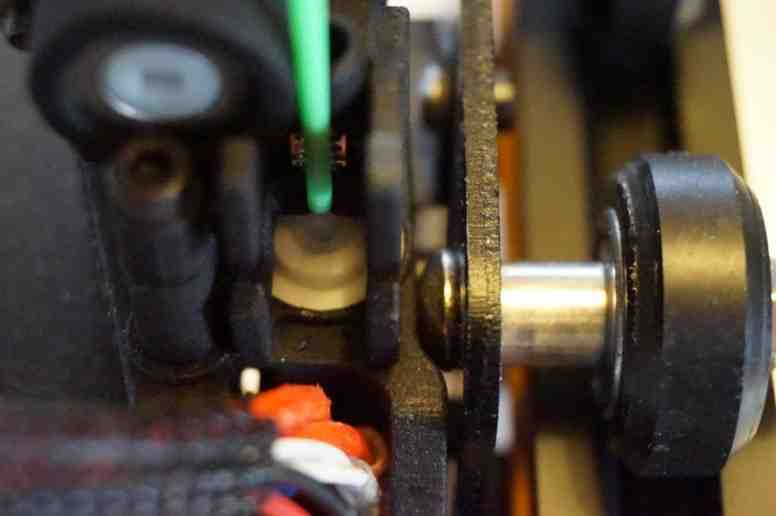

    Insert the filament into the PTFE tube inside the Sidewinder.

Step 3
-------

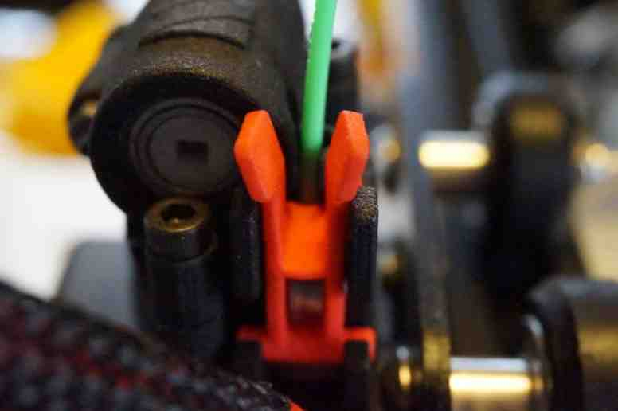
   
    Close the Breech, making sure it latches properly.

Step 4
-------

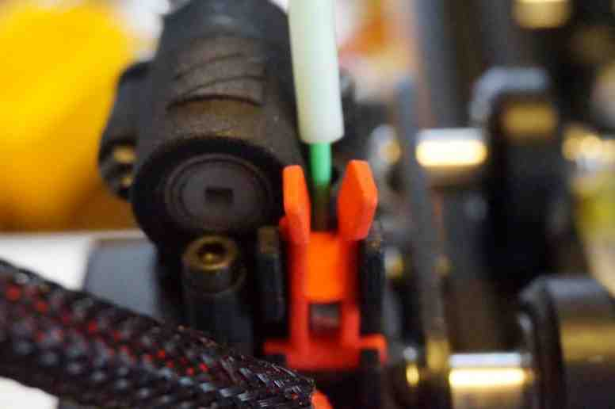

    If you are using the rest of the bodwen tube to guide the filament, slide it down and push it into the Sidewinder.

Step 5
-------

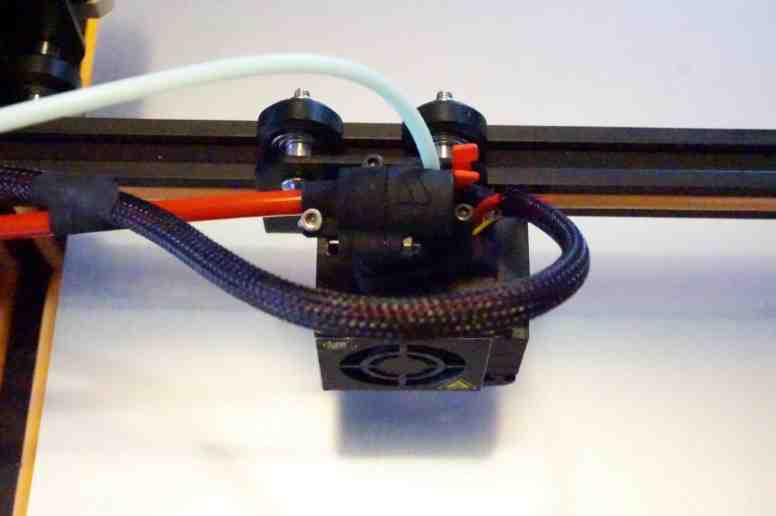

    This is what it looks like as you are ready to print!

    * all that needs to be done now is add some start gcode to your slicer.

Configuring the Slicer
======================

You do not need to adjust anything to your material profiles or layer settings. All you need to do is set start commands for your printer. 
So in your slicer, open the Printer settings and add the following code to your Startup Gcode:

;Marlin Setup g.code
M92 E2650   ; Set steps/mm extrusion
M201 E120   ; Set Extruder acceleration 
M204 T120   ; Set Retract acceleration
M205 E3     ; Set Extruder Jerk
M203 E45    ; Maximum feed rate

.. Note:: These settings are correct, but it is always a good idea to see them as a starting point and then tweak settings on your system for optimal results.

Optional extra's 
================

We have a few optional extra's that are available on Thingiverse.

* New air duct for print cooling, using tusks. https://www.thingiverse.com/thing:2772134

* Small tray to support the drive cable above the X stepper. https://www.thingiverse.com/thing:2802704

* Extra mount to hold the bowden tube at the filament sensor. 
