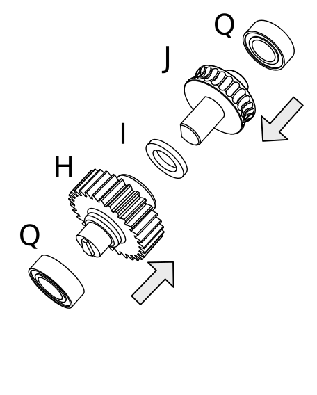
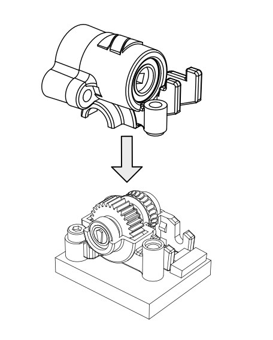
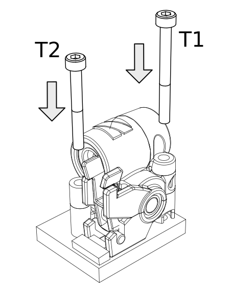
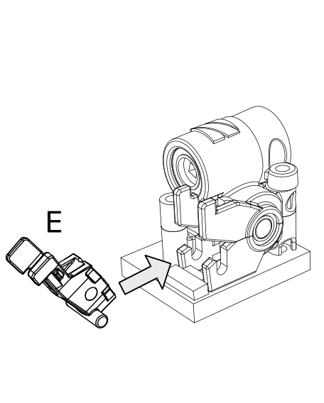
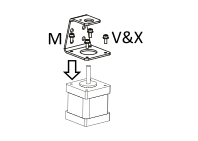
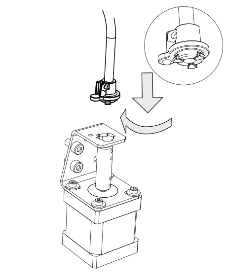
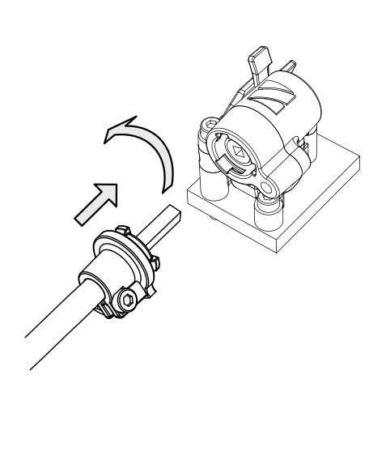
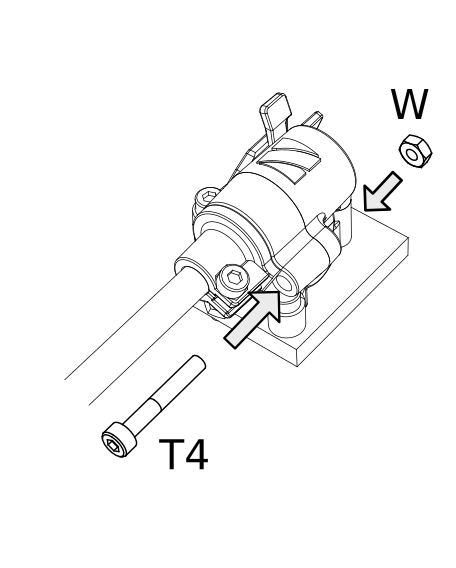

Assembling a Sidewinder
==========================

Step 1
------

.. figure:: images/step01.svg
    :alt: Insert worm bearing
    :height: 400px
    :width: 286px

    You will use the Worm bearing (part P) and the Top Housing (part B)
    
    * Insert one bearing into the shell housing.
    
    .. Note:: This can require a little force. If you cannot get it right, you can use the Worm (part G) to push the bearings in properly.

Step 2
------   

.. figure:: images/step02.svg
    :alt: Insert worm bearing in lid
    :height: 400px
    :width: 286px

    You will use the Worm bearing (part P) and the Worm Lid (part D)
    
    * Insert one bearing into the shell housing.
    
    .. Note:: This can require a little force. If you cannot get it right, you can use the Worm (part G) to push the bearings in properly.

Step 3
------  

.. figure:: images/step03.svg
    :alt: Insert worm and close lid
    :height: 400px
    :width: 286px

    Apply grease from silver packet to the Worm (part G) then insert in the bearing of the Top Housing.
    
    * Slide the Worm Lid over the Worm and close the top half of the Sidewinder.

Step 4
------  

    To assemble the gear shaft take the following parts:
    * Gear shaft bearings (Part Q) 2x
    * Gear shaft/Hobbed wheel (Part J)
    * Spacer Ring (Part I)
    * Gear wheel (H)

    * Notice that on the end of the plastic part of the gear shaft we have included a little indicator to show you that the gear is turning. The shafts are so smooth that you would not be able to see it otherwise. If you want you can use a permanent marker to colour the outside surface of the indicator to make it more visible.
    * Slide the Spacer Ring over the long shaft of Gear Shaft (Part J)
    * Insert the Gear shaft into the Gear and make sure the flat parts match. This needs a little push as it is supposed to be a close fit. 
    * Check to make sure the Spacer Ring is between the Gear Shaft and Gear Wheel
    * Now fit the Gear shaft bearings on both sides 

Step 5
------  
       
.. figure:: images/step05.svg
    :alt: Mount Base to adapter
    :height: 400px
    :width: 286px

    Mount the Bottom Housing (Part A) to the Nimble Sidewinder adapter of your choosing.

    * Only use the screw T3 for now. This is done as the screw is not easy to access after the Nimble Sidewinder is completely assembled.

Step 6
------

.. figure:: images/step06.svg
    :alt: Insert gear set in bottom housing
    :height: 400px
    :width: 286px

    Fit the combined gear shaft and hob into the Bottom Housing.

Step 7
------

    Fit the assembled upper housing onto the Bottom Housing. 

    * Make sure the little tabs and extra ridges fit neatly into the Bottom Housing, These are used to lock the shells into the correct position.

Step 8
------

    Use the remaining two long bolts (Part T1 and T2) to bolt the complete Sidewinder to the chosen adapter.

    * Do not overtighten these M3 bolts. Simply finger tight and then 1/4 turn is enough. 

Step 9
------

    Place the Breech block (part E) into the housing. 

    * This will lock into place with a click. 
    * To do so, keep the breech block horizontal, place the shafts into the bottom grooves of the housing and lever the breech block upwards, between the upper “forks” until it clicks into place.

Step 10
------

    Mount stepper to Bracket

    * Moving to the other end, the stepper. Mounting the Bracket (part M) to your stepper, using the M3 screws (V). 
    * The center hole will make sure the stepper is centered in the Bracket. 
    * If the center hole is too big, please try to center the Bracket as perfectly as you can.

Step 11
-------

.. figure:: ../nimble/images/1_step10.svg
    :alt: Bolt Bracket to printer
    :height: 400px
    :width: 286px

    Bolt Bracket to printer

    * Mount the stepper to your printer frame. The image shows it being mounted to a 20x20 aluminium profile. 
    
    .. Note:: Other methods can be; mounting it to the base, attaching it to a bracket and mounting that to your printer or any other way of fixing the stepper to your printer. The mounting hardware is not included.

Step 12
-------

.. figure:: ../nimble/images/1_step11.svg
    :alt: Insert Coupler on stepper shaft
    :height: 400px
    :width: 286px

    Insert Coupler on stepper shaft

    * Place the Coupler (part N) on the shaft of the stepper. 
    * The Coupler should fit through the top hole of the Bracket. 
    * Slide it down until there is approx 1.5 mm space between the stepper base and the Coupler. See step 12

Step 13
-------

.. figure:: ../nimble/images/1_step12.svg
    :alt: Tighten bottom set screw
    :height: 400px
    :width: 286px

    Tighten bottom set screw

    * Rotate the Coupler until the bottom set screws are perpendicular to the flat on the stepper shaft (if there is one). 
    
    .. Note:: Make sure there still is approx 1.5 mm space between the stepper base and the Coupler and tighten the bottom set screw (part Y).

Step 14
-------

    Slide Drive Cable Sleeve into Sleeve Clamp (Stepper side)

    * Take the Sleeve Clamp (part C) and slide the Drive Cable Sleeve (part F) in the top, as far as it will go. There is a little step in the bottom of the sleeve clamp to make sure the sleeve goes in just to the right depth. 
    * Clamp the sleeve using the M3 screw (part Z) and the Half nut (part W). Tighten the screw nice and tight. 
      
    .. Note:: There is a little ridge inside the sleeve clamp to prevent you from squeezing the sleeve too far and jamming the drive cable.

Step 15
-------

    Insert the Bracket Sleeve Clamp (Part C1) into the Bracket (Part M) and rotate to lock.
    * The first time you turn the Sleeve Clamp, it might need some force to rotate. 
    
    .. Note:: Make sure you insert the Sleeve Clamp in such a way that once rotated in position, the little tab clicks into the small hole on the Bracket.

Step 16
-------

.. figure:: ../nimble/images/1_step16.svg
    :alt: Slide Drive Cable into Coupler
    :height: 400px
    :width: 286px

    Slide Drive Cable into Coupler. 

    * Now, take the drive cable itself (part L), both ends have square sides pressed into it. Even here it is reversible. 
    * Slide one end into the Drive Cable Sleeve and thread it all the way through. It will slide into the Coupler. 
    * Slide it all the way down and clamp it using the remaining 4 set screws (part Y)

Step 17
-------

.. figure:: ../nimble/images/1_step17.svg
    :alt: Insert sleeve in sleeve clamp
    :height: 400px
    :width: 286px

    Slide Drive Cable Sleeve into Sleeve Clamp (Sidewinder side) 

    * Back to the Sidewinder side. 
    * Slide the Sleeve, now containing the drive cable as well, into the next Sleeve Clamp (part C) and push it down as far as it will go. Use the M3 screw (part Z) and the half nut (part W) to clamp the sleeve. 

    .. Note:: After mounting the Sidewinder in place, you can loosen this screw a little to adjust the direction of the drive cable. Allow it to have a relaxed and free arch to the stepper.

Step 18
-------

    Insert the Drive cable into the Worm and slide the Sleeve Clamp into the Worm Lid. 
    
    * Rotate to lock Sleeve Clamp into position.
    * The first time you turn the Sleeve Clamp, it might need some force to rotate.

    .. Note:: Make sure you insert the Sleeve Clamp in such a way that once rotated in position, the bolt hole lines up with the bolt hole on the Worm lid and Upper Housing.

Step 19
-------

    Insert the Sleeve Clamp screw (Part T4) through the Sleeve Clamp and upper housing of the Sidewinder.
    
    * Use the Nut (Part W) to close it and lock it all in place.
    
    .. Note:: Do not overtighten this M3 bolt. Simply finger tight and then 1/4 turn is enough. 

Using the Sidewinder
#####################

First run the extruder a minute or two, with no filament clamped. Just to bed the gears and drive cable in. Extrude and retract a few times. (You will have to switch off the temperature control as most controllers will not move the extruder stepper unless the hot end it up to temperature)
Use M302 P1 on RepRapFirmware to switch cold extrusion on (allow extrusion while cold) and M302 P0 to switch it off again.
For other firmware use M302 S0 to switch cold extrusion on and M302 S170 to set extrusion to a minimum temp of 170C.

Insert filament
###############

To insert filament, open the breech block. You do this by squeezing together the "ears" of the breech block and pulling outwards. You can leave the shafts of the breech block in or, for better visibility, take the whole breech block out. 

Now you can see the PTFE on the top of your hotend (usually, depends on the adapter used) and slide the filament in. If the hot end is up to the correct temperature, you can purge the old filament by simply pushing down on the filament and feeding it into the hot end. After the old filament is cleared you can close the breech block.

.. Note:: this is is an excellent way to get a sense of the efficiency of your hot end. You can feel the resistance of the hot end and how easy it is to push the filament through.

To close the breech block, place the shafts into the slots of the "forks" on the Sidewinder, rotate until vertical and the ears click into place. The Sidewinder is now ready to use.

If your hotend is up to temperature, you can now test the extrusion. Simply extrude about 10 mm and observe how the filament comes out of the hot end. It should be a neat straight line.

Tuning the Firmware
###################

Before using the Sidewinder you need to tune the firmware and calibrate the extrusion. You will need to tune the firmware first, as the Sidewinder is quite a different type of extruder. 

See the :doc:`Tuning the Firmware<./tuning>` page or click Next.

